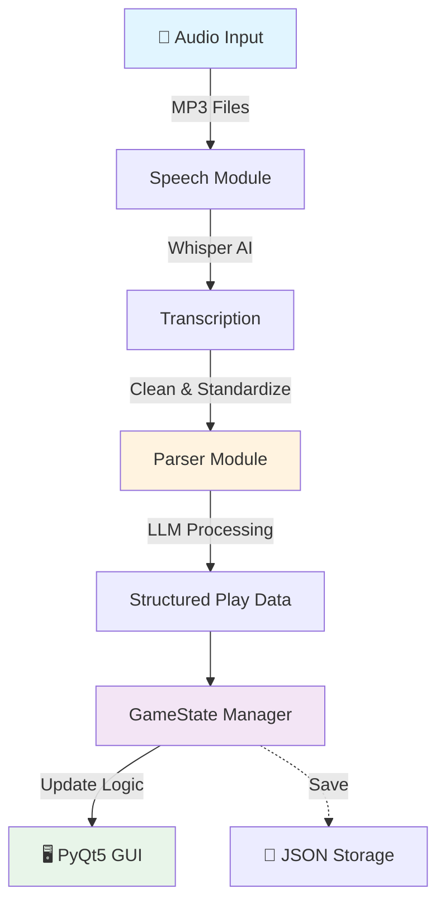

<div align="center">

# ⚾ AI Scorekeeping.

### Speech-Automated Real-time Game Tracker

*A voice-activated baseball scorekeeping system powered by AI*

[Features](#-features) • [Installation](#-installation) • [Usage](#-usage) • [Architecture](#-architecture)

---

</div>

## 🎯 What is AI VR?

AIVR changes the way baseball games are scored by allowing scorekeepers to process and record plays in the most natural way, speech!

## 🌟 Features

<table>
<tr>
<td width="50%">

### Features
- 🎙️ Voice command recognition
- 🤖 LLM-based natural language parsing
- 🖥️ Live GUI after each run 
- 📝 JSON persistence
- 🔙 Undo system

</td>
</tr>
</table>

---

## 🏗️ Architecture



<details>
<summary><b>🔍 Component Details</b></summary>

| Component | Technology | Purpose |
|-----------|-----------|---------|
| **Speech Recognition** | OpenAI Whisper | Converts audio to text |
| **NLP Parser** | LangChain + Ollama | Extracts structured play data |
| **Game Logic** | Pydantic | Manages state and validation |
| **Interface** | PyQt5 | Visual scoreboard display |

</details>

---

## 🚀 Installation

### Prerequisites

Before you begin, ensure you have:

- 🐍 **Python 3.9** (can use pyenv for this if necessary)
- 🎬 **ffmpeg** (for audio processing)
- 🦙 **Ollama** with llama3.1 model

### Quick Start

```bash
# 1️⃣ Clone the repository
cd SARG-project

# 2️⃣ Install Python dependencies
pip install -r requirements.txt

# 3️⃣ Ensure ollama is installed, and run in a separate terminal.
ollama serve


# 4️⃣ Install ffmpeg
brew install ffmpeg 

```

> 💡 **Windows Users**: Download ffmpeg from [ffmpeg.org](https://ffmpeg.org/download.html)

---

## 💻 Usage

### Basic Workflow

```python
# 1. Prepare your audio files (Record using ffmpeg)
play_files = ["play1.mp3", "play2.mp3", "play3.mp3"]

# 2. Run the program
python3 main.py

# 3. Watch the scorekeeping output
```

### 🎙️ Announcement Format

#### Examples (More ambiguity coming soon)

For best results, follow MLB Gameday structure:

Pair with batter movements for improved accuracy

Eg:

Ohtani singles on a line drive to left field. Ohtani to first.

Addison singles on a line drive to left field, Ohtani to second, Addison to first.

#### (Ohtani to first and Addison to first) are optional, but highly recommended.

#### (If you want to undo plays, simply record a mp3 file and say "Undo")


### The Pipeline

```
+---------------------------------------------------------+
| 1. AUDIO CAPTURE                                        |
|                                                         |
|  - Record or load MP3 files                             |
+-------------------------+-------------------------------+
                          |
                          v
+---------------------------------------------------------+
| 2. TRANSCRIPTION (Whisper)                              |
|                                                         |
|  "Marcus hits a single to center field"                 |
|  - Clean & standardize transcript                       |
+-------------------------+-------------------------------+
                          |
                          v
+---------------------------------------------------------+
| 3. PARSING (LLM)                                        |
|                                                         |
|  - Extract structured data                              |
|    * Play type: "single"                                |
|    * Batter: "Marcus"                                   |
|    * Runner movements                                   |
+-------------------------+-------------------------------+
                          |
                          v
+---------------------------------------------------------+
| 4. STATE UPDATE                                         |
|                                                         |
|  - Apply play to game state                             |
|  - Validate logic                                       |
|  - Save to history                                      |
+-------------------------+-------------------------------+
                          |
                          v
+---------------------------------------------------------+
| 5. DISPLAY                                              |
|                                                         |
|  - Update GUI scoreboard                                |
|  - Show play-by-play                                    |
+---------------------------------------------------------+

```

---


## 📊 Performance Metrics (Depends on local hardware due to Ollama. Beware running large amounts of plays.)

| Operation | Time | Technology |
|-----------|------|------------|
| 🎤 **Transcription** | 2-5s |
| 🧠 **Parsing** | 1-3s |
| ⚡ **State Update** | <0.1s |
| **Total** | **3-8s per play** |

---

## 📚 Tech Stack

<div align="center">

| Category | Technologies |
|----------|-------------|
| **AI/ML** |  |
| **Framework** |   |
| **Language** |  |
| **Storage** |  |

</div>

<div align="center">

**Any questions, email npate137@jh.edu**

</div>
