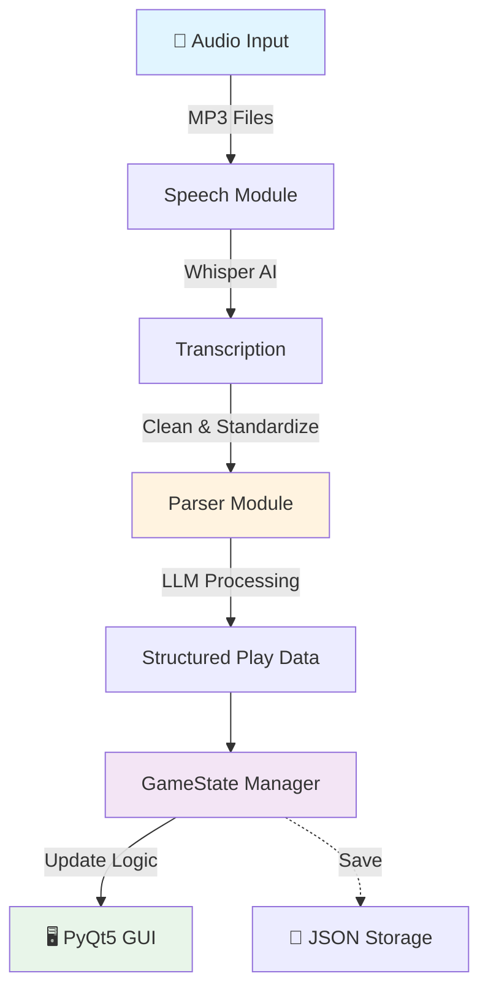

<div align="center">

# ⚾ AI Scorekeeping.

### Speech-Automated Real-time Game Tracker

*A voice-activated baseball scorekeeping system powered by AI*

[Features](#-features) • [Installation](#-installation) • [Usage](#-usage) • [Architecture](#-architecture)

---

</div>

## 🎯 What is AI VR?

AIVR changes the way baseball games are scored by allowing scorekeepers to process and record plays in the most natural way, speech!

## 🌟 Features

<table>
<tr>
<td width="50%">

### Features
- 🎙️ Voice command recognition
- 🤖 LLM-based natural language parsing
- 🖥️ Live GUI after each run 
- 📝 JSON persistence
- 🔙 Multi-level undo system

</td>
</tr>
</table>

---

## 🏗️ Architecture



<details>
<summary><b>🔍 Component Details</b></summary>

| Component | Technology | Purpose |
|-----------|-----------|---------|
| **Speech Recognition** | OpenAI Whisper | Converts audio to text |
| **NLP Parser** | LangChain + Ollama | Extracts structured play data |
| **Game Logic** | Pydantic | Manages state and validation |
| **Interface** | PyQt5 | Visual scoreboard display |

</details>

---

## 🚀 Installation

### Prerequisites

Before you begin, ensure you have:

- 🐍 **Python 3.9** (can use pyenv for this if necessary)
- 🎬 **ffmpeg** (for audio processing)
- 🦙 **Ollama** with llama3.1 model

### Quick Start

```bash
# 1️⃣ Clone the repository
cd SARG-project

# 2️⃣ Install Python dependencies
pip install -r requirements.txt

# 3️⃣ Ensure ollama is installed, and run in a separate terminal.
ollama serve


# 4️⃣ Install ffmpeg
brew install ffmpeg 

```

> 💡 **Windows Users**: Download ffmpeg from [ffmpeg.org](https://ffmpeg.org/download.html)

---

## 💻 Usage

### Basic Workflow

```python
# 1. Prepare your audio files
play_files = ["play1.mp3", "play2.mp3", "play3.mp3"]

# 2. Run the program
python3 main.py

# 3. Watch the scorekeeping output
```

### 🎙️ Announcement Format

For best results, follow this structure:

```
[Batter Name] [Action]. Count: [Balls]-[Strikes]. [Base State]. [Outs]. [Score].
```

#### Examples (More ambiguity coming soon)

| Play Type | Announcement |
|-----------|-------------|
| **Ball** | `Marcus takes a ball. Count: 1-0. Bases empty. No outs. Score: 0-0.` |
| **Home Run** | `Jessica hits a home run. Count: 0-0. Bases empty. No outs. Score: 2-0.` |
| **Ground Out** | `Chen grounds out to shortstop. Count: 0-0. Bases empty. 1 out. Score: 2-0.` |
| **Double** | `Sarah doubles to left field. Count: 2-1. Runner on first. 1 out. Score: 3-1.` |


---

## 📁 Project Structure

```
SARG-project/
│
├── 🎯 main.py              # Entry point & orchestration
├── 🎮 gamestate.py         # Core game logic
├── 📋 schema.py            # Data models (Pydantic)
├── 🧠 parse_play.py        # LLM play parser
├── 🎤 speech.py            # Whisper transcription
├── 🖥️ userinterf.py        # PyQt5 GUI
├── 🎙️ recorder.py          # Audio utilities
│
├── 📖 README.md
├── 📦 requirements.txt
└── 📂 audio/
    ├── play1.mp3
    ├── play2.mp3
    └── ...
```

---

### The Pipeline

```
┌─────────────────────────────────────────────────────────┐
│  1. AUDIO CAPTURE                                       │
│  🎤 Record or load MP3 files                            │
└───────────────────┬─────────────────────────────────────┘
                    ▼
┌─────────────────────────────────────────────────────────┐
│  2. TRANSCRIPTION (Whisper)                             │
│  🗣️  "Marcus hits a single to center field"            │
│  🧹 Clean & standardize transcript                      │
└───────────────────┬─────────────────────────────────────┘
                    ▼
┌─────────────────────────────────────────────────────────┐
│  3. PARSING (LLM)                                       │
│  🤖 Extract structured data:                            │
│     • Play type: "single"                               │
│     • Batter: "Marcus"                                  │
│     • Runner movements                                  │
└───────────────────┬─────────────────────────────────────┘
                    ▼
┌─────────────────────────────────────────────────────────┐
│  4. STATE UPDATE                                        │
│  🎮 Apply play to game state                            │
│  ✅ Validate logic                                      │
│  💾 Save to history                                     │
└───────────────────┬─────────────────────────────────────┘
                    ▼
┌─────────────────────────────────────────────────────────┐
│  5. DISPLAY                                             │
│  🖥️  Update GUI scoreboard                             │
│  📊 Show play-by-play                                   │
└─────────────────────────────────────────────────────────┘
```

---

## 🧪 Testing

### Run Test Sequences

```python
# Complete half-inning test (12 plays)
play_files = [f"test_play{i}.mp3" for i in range(1, 13)]
python3 main.py

# Expected final state:
# AWAY: 3 | HOME: 0 | Inning: Bottom 1, Count: 0-0, Outs: 0
```


## 📊 Performance Metrics

| Operation | Time | Technology |
|-----------|------|------------|
| 🎤 **Transcription** | 2-5s | Whisper (base) |
| 🧠 **Parsing** | 1-3s | llama3.1 |
| ⚡ **State Update** | <0.1s | Python |
| **Total** | **3-8s per play** | - |

---

## 📚 Tech Stack

<div align="center">

| Category | Technologies |
|----------|-------------|
| **AI/ML** |  |
| **Framework** |   |
| **Language** |  |
| **Storage** |  |

</div>

<div align="center">

**Any questions, email npate137@jh.edu**

</div>
